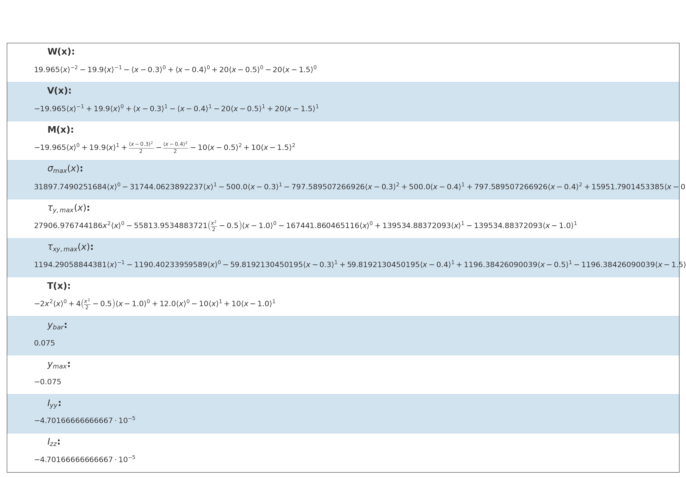

# Overview

This repository represents the result of a short collaboration of a two-member group for the final assignment of the *Strength of Materials I* course lectured by [Dr. Maryam Mahnama](https://orcid.org/0000-0003-0220-0308) in the Department of Mechanical Engineering at University of Tehran. In this project, we created a program as a domestic equivalent of [SkyCiv](https://skyciv.com/free-beam-calculator/) website which calculates reactions, shear force, bending moment, deflection and stress for cantilever or simply supported beams. We had the opportunity to implement this in *Matlab Designer*, but we decided to bring up a website as the program GUI. Thus, we used **Django** for the back-end of the project and **HTML5** and **CSS3** for its front-end. More details of the assignment and the methods we used to address the project requirements are available in the PDF files attached in this repository. Since no funding was allocated to this project, the budget limitations prevented the authors to deploy this website on a permanent global domain on World Wide Web nor to develop and modify it after the project's first deadline. Here's an overview of the website on a local server:

# Homepage

# Beam Geometry

# Beam Supports

# Forces

# Momentum and Torques

# Results
Here's the calculated and plotted results for a simple case study of a beam of $2 m$ long, under a constant load of $F=-10 \frac{kN}{m}$ from $x=0.5 m$ to $x=1.5 m$ .

